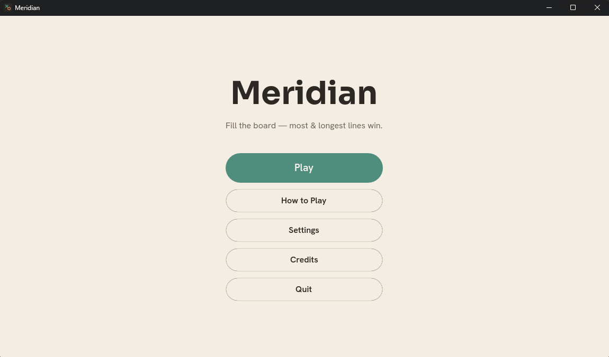
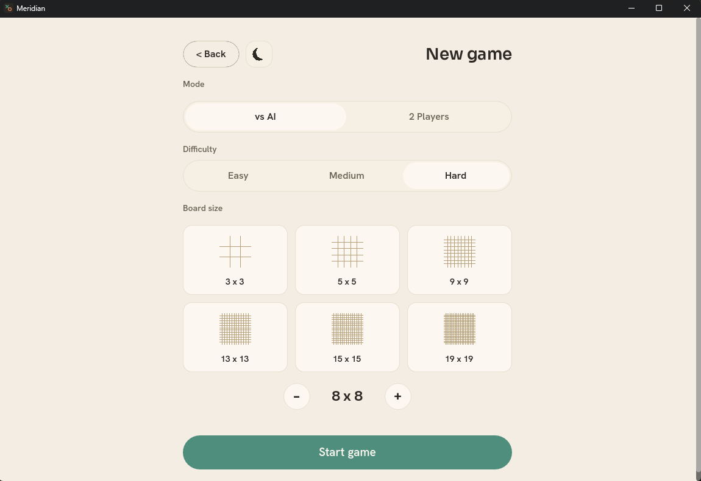
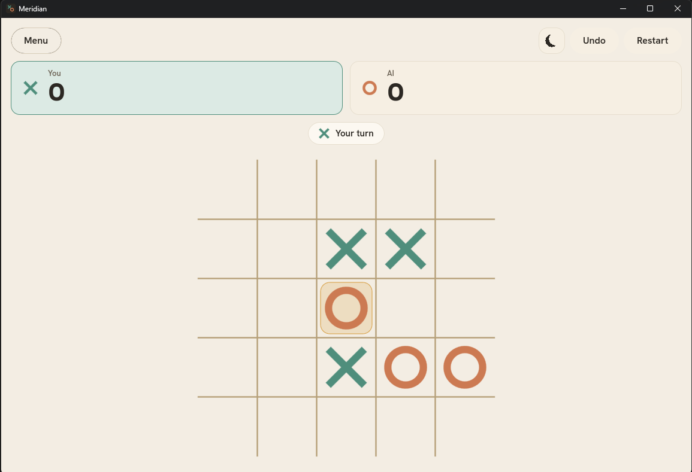
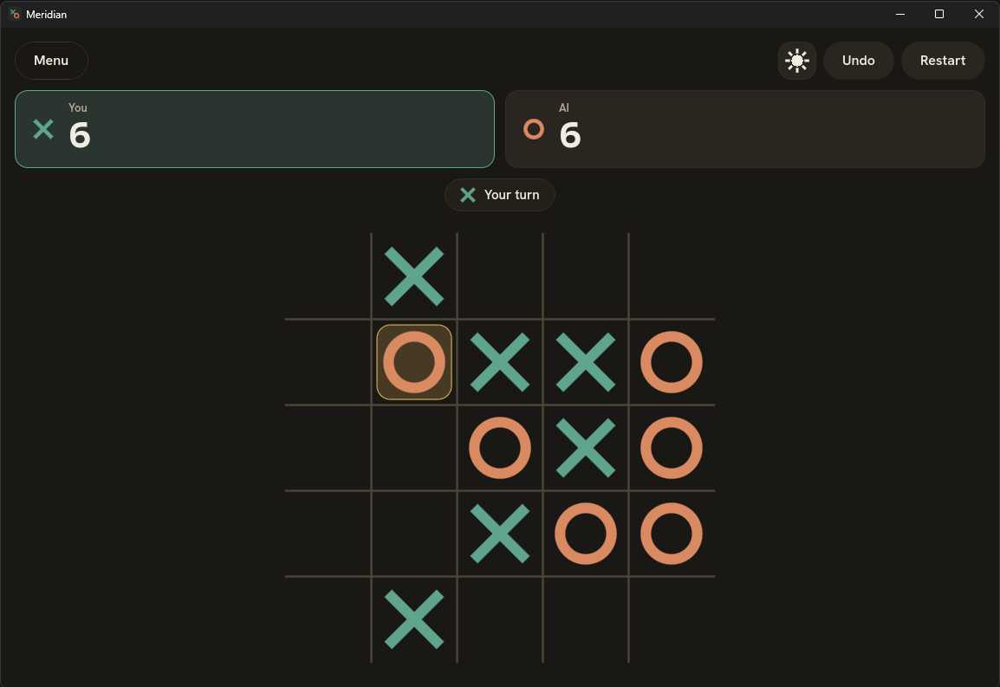

# 🎯 Meridian

A polished, modern tic-tac-toe game built in **Godot 4** with **GDScript**. Play on a customizable board (3×3 to 19×19), compete against an intelligent AI, or challenge a friend locally.


**🌐 Language:** **English** · [فارسی](README.fa.md)

---

## ✨ What makes it different

Meridian isn't win-on-3 tic-tac-toe. The board **always fills completely** — there's no early win. Once every cell is placed, the board is scored: each player earns points for every straight run of 3 or more of their own mark, and the highest total wins.

That one rule change turns a solved children's game into something with actual depth — every move matters until the very last cell, and a "losing" position can still turn into a comeback on the final tally. 🔥

---

## 📸 Screenshots

| Main Menu | New Game Setup |
|:---:|:---:|
|  |  |

| Mid-game (Light) | Late-game (Dark) |
|:---:|:---:|
|  |  |

---

## 🕹️ Gameplay

- **Fill the entire board** — no early wins; the game ends only when every cell is occupied.
- **Score maximal runs** — after the board fills, every straight line of 3+ identical marks (horizontal, vertical, or either diagonal) scores points for its owner.
- **Scoring formula** — a run of length *L* is worth *L* points (a 3-line scores 3, a 5-line scores 5, and so on). Highest total wins; equal totals draw.
- **Two modes**:
  - 🤖 **vs AI** — Easy / Medium / Hard difficulty
  - 👥 **2 Players** — local pass-and-play on one device
- **Any board size** — pick a preset (3×3, 5×5, 9×9, 13×13, 15×15, 19×19) or dial in a custom size with the stepper.

## 🚀 Features

- **Non-blocking AI** — negamax search with alpha-beta pruning runs on a worker thread with a per-move time budget, so the UI never freezes; a "thinking" pulse shows on the AI's target cell.
- 🌗 **Light & dark themes**, with an optional purple accent — togglable anywhere, including mid-game, without losing your board state.
- 🔊 **Full audio** — SFX for placement, UI interactions, win/draw/game-over, plus looping in-game music; independently toggle sound and music.
- **Undo & Restart**, animated mark placement, score count-up, and run-band highlights over the winning lines at game end.
- 💾 **Persistent settings** — last mode, difficulty, board size, theme, and audio preferences are all saved to `user://`.
- **Built-in "How to Play" guide** with real board illustrations and a worked scoring example.
- **Responsive layout** — square, centered board; scales for desktop windows today, with mobile/portrait support planned.

## 🧮 Scoring, by example

After the board fills, every **maximal** run of 3+ identical marks scores for its owner — a run is "maximal" if the cell just before it (in that direction) is empty or belongs to the other player.

- A horizontal run of 3 X's → **3 points** for X
- A diagonal run of 5 O's → **5 points** for O
- Two separate runs of 4 → **8 points**, not 4 — every maximal run counts on its own

Sum every maximal run across all 4 directions for both players; the higher total wins, equal totals draw.

## 🧠 AI difficulty

The AI uses **negamax search with alpha-beta pruning**, move ordering, and transposition tables:

| Difficulty | Behavior |
|---|---|
| Easy | Shallow search with an intentional blunder chance |
| Medium | Deeper search with move ordering |
| Hard | Full-depth search with transposition tables, scaled to the per-move time budget |

Search always runs off the main thread, regardless of difficulty or board size.

---

## 📁 Project structure

```
Meridian-Tic-Tac-Toe/
├── PROTOTYPE.py           # Original Python reference (rules validation only)
├── reference/              # Design reference (tokens.css, game.css, board.js) — not built code
├── assets/
│   ├── branding/            # Logo & icons (SVG)
│   ├── screenshots/         # Images used in this README
│   ├── fonts/                # Sora, Hanken Grotesk, JetBrains Mono
│   ├── sfx/                  # Sound effects
│   └── music/                # Background music
├── scripts/
│   ├── core/                 # Pure game logic: board, rules, scoring (no UI deps, unit-testable)
│   ├── ai/                    # Negamax search + evaluation
│   └── ui/                    # Screens, components, autoloads (Settings, ThemeManager, Audio)
├── scenes/                 # Godot scenes (App, MainMenu, GameSetup, Game, Settings, Board, ...)
├── theme/                   # theme.tres + font resources
├── tests/                   # GdUnit4 test suite
└── build/                   # Windows export output (gitignored)
```

---

## ⚙️ Getting started

### Prerequisites

- **Godot 4.6+** ([download](https://godotengine.org/download))

### Run in the editor

1. Launch Godot 4 → **Import** → select this project's folder.
2. Press **F5**, or **Run ▸ Play**.

### Run headless (CLI)

```bash
# One-time asset import
godot --headless --path . --import

# Run the game
godot --path .
```

### Run tests (GdUnit4)

```bash
godot --headless --path . -s res://addons/gdUnit4/bin/GdUnitCmdTool.gd -a res://tests --ignoreHeadlessMode
```

### Export for Windows

```bash
godot --headless --export-release "Windows Desktop" build/Meridian.exe
```

---

## 🛠️ Built with

- **Godot 4.6** / **GDScript**
- **GdUnit4** for unit testing
- **Sora**, **Hanken Grotesk**, **JetBrains Mono** (Google Fonts)

## 📱 Platform support

- 🪟 **Windows** — primary target, export-ready
- 🤖 **Android** — planned; touch input and mobile rendering settings already verified

## 📄 License

MIT — see [LICENSE](./LICENSE).

## 👤 Author

**AmirHossein** — [GitHub](https://github.com/AmirHossein143)

---

**🌐 Language:** **English** · [فارسی](README.fa.md)
